# Autonomous Navigation Bug Fix Summary

## **Problem Identified**
The drone controller was switching to autonomous mode successfully when frontier exploration triggered the service, but was **not navigating autonomously** to exploration targets.

## **Root Cause Analysis**
1. **Frontier Explorer** was working perfectly:
   - DFS flood-fill algorithm detecting frontiers ✅
   - DBSCAN clustering working ✅  
   - Multi-criteria utility ranking functional ✅
   - Publishing to `/frontiers_ranked` topic ✅

2. **PX4 Controller** had a critical communication gap:
   - Successfully subscribing to `/frontiers_ranked` ✅
   - **BUG**: `FrontiersCallback` was only storing frontiers but **not processing them for navigation** ❌
   - Navigation methods `ProcessFrontierGoal()` and `StartPointCloudNavigation()` existed but were never called ❌

## **Solution Implemented**

### 1. **Fixed FrontiersCallback Method**
**Location**: `/src/flyscan_drone_controller/src/px4_controller.cpp:453`

**Before (Broken)**:
```cpp
void PX4Controller::FrontiersCallback(...) {
    // Only stored frontiers - NEVER processed them!
    current_frontiers_ = *msg;
    // No navigation logic!
}
```

**After (Fixed)**:
```cpp  
void PX4Controller::FrontiersCallback(...) {
    // Smart state management
    if (navigation_state_ == NavigationState::kIdle && !msg->frontiers.empty()) {
        // Auto-process best frontier (highest utility)
        const auto& best_frontier = msg->frontiers[0];
        
        // Convert to PoseStamped and navigate immediately
        ProcessFrontierGoal(frontier_goal);
    } else if (navigation_state_ != NavigationState::kIdle) {
        // Prevent interrupting current navigation
        RCLCPP_INFO(..., "Already navigating - will process after current goal");
    }
}
```

### 2. **Added Intelligent Navigation State Management**
- **Navigation State Checking**: Only process new frontiers when `NavigationState::kIdle`
- **Prevents Interruption**: Avoids switching targets mid-navigation
- **Continuous Exploration**: Automatically processes next frontier when current goal completes
- **Utility-Based Selection**: Always chooses highest utility frontier first

### 3. **Enhanced Navigation Completion Handling**
**Location**: `PointCloudNavigationTimerCallback()` 

```cpp
if (distance_to_target < waypoint_tolerance_) {
    navigation_state_ = NavigationState::kIdle;
    RCLCPP_INFO(..., "Navigation completed - reached target");
    
    // NEW: Try to process next frontier automatically
    TryNextFrontier();
    return;
}
```

## **Technical Flow (Fixed)**

```mermaid
sequenceDiagram
    participant FE as Frontier Explorer
    participant PX4 as PX4 Controller  
    participant NAV as Navigation System

    FE->>FE: Detect frontiers via DFS+DBSCAN
    FE->>FE: Rank by utility (distance×0.3 + size×0.3 + info×0.4)
    FE->>PX4: Publish ranked frontiers to /frontiers_ranked
    
    Note over PX4: NEW: Smart Processing Logic
    PX4->>PX4: Check navigation_state == kIdle?
    alt Navigation Idle
        PX4->>PX4: Get best frontier (index 0)
        PX4->>NAV: ProcessFrontierGoal() → StartPointCloudNavigation()
        NAV->>NAV: Calculate optimal camera position
        NAV->>NAV: Execute point cloud navigation
        NAV->>PX4: Navigation complete
        PX4->>PX4: TryNextFrontier() → Continue exploration
    else Navigation Active  
        PX4->>PX4: Queue for later processing
    end
```



## **Expected Behavior Now**

1. **Service Trigger**: Frontier exploration service triggers successfully ✅
2. **Mode Switch**: Drone switches to autonomous mode ✅  
3. **NEW**: **Automatic Navigation**: Drone immediately navigates to best frontier ✅
4. **NEW**: **Continuous Exploration**: Upon reaching target, automatically selects next frontier ✅
5. **NEW**: **Smart State Management**: Prevents navigation conflicts ✅

## **Key Log Messages to Watch**

### **Success Indicators**:
```bash
[px4_controller]: Auto-processing best frontier with utility 0.847 at (12.34, -5.67, 2.10)
[px4_controller]: Starting point cloud navigation to (12.34, -5.67, 2.10)  
[px4_controller]: Point cloud navigation completed - reached target
[px4_controller]: Trying next frontier 2/5 with utility 0.723
```

### **State Management**:
```bash
[px4_controller]: Already navigating (state: 2) - will process after current goal
[px4_controller]: Received 8 ranked frontiers
```

## **Testing Instructions**

### 1. **Launch System**
```bash
# Terminal 1: Start simulation
ros2 launch flyscan_sim flyscan_sim.launch.py

# Terminal 2: Start frontier exploration
ros2 run flyscan_exploration frontier_explorer

# Terminal 3: Start PX4 controller  
ros2 run flyscan_drone_controller px4_controller

# Terminal 4: Trigger autonomous mode
ros2 service call /px4_controller/set_control_mode flyscan_interfaces/srv/SetControlMode "{mode: 3}"
```

### 2. **Verify Fix Working**
- ✅ **Service Response**: Service call returns success
- ✅ **Mode Switch**: Drone logs "Entering autonomous mode"
- ✅ **Auto Navigation**: Should immediately see "Auto-processing best frontier..." 
- ✅ **Movement**: Drone should start navigating to exploration targets
- ✅ **Continuous**: After reaching one frontier, should automatically go to next

## **Files Modified**
- ✅ `/src/flyscan_drone_controller/src/px4_controller.cpp` - Fixed FrontiersCallback and navigation completion
- ✅ **Build Status**: Successfully compiled with no errors

## **Next Steps**
1. **Test in Simulation**: Launch system and verify autonomous navigation works end-to-end
2. **Monitor Logs**: Check for the success indicator messages above
3. **Performance Validation**: Ensure smooth transitions between frontiers
4. **Real Hardware Testing**: Deploy to physical drone after simulation validation

---

## **Summary**
The critical communication gap between frontier exploration and autonomous navigation has been **fixed**. The drone should now:
- ✅ Receive frontier exploration service trigger  
- ✅ Switch to autonomous mode
- ✅ **Navigate autonomously to exploration targets** (NEW!)
- ✅ **Continue exploring until complete** (NEW!)

**Status**: 🟢 **READY FOR TESTING**
