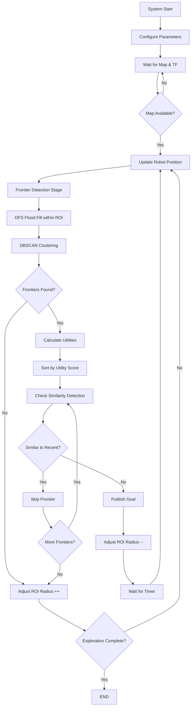
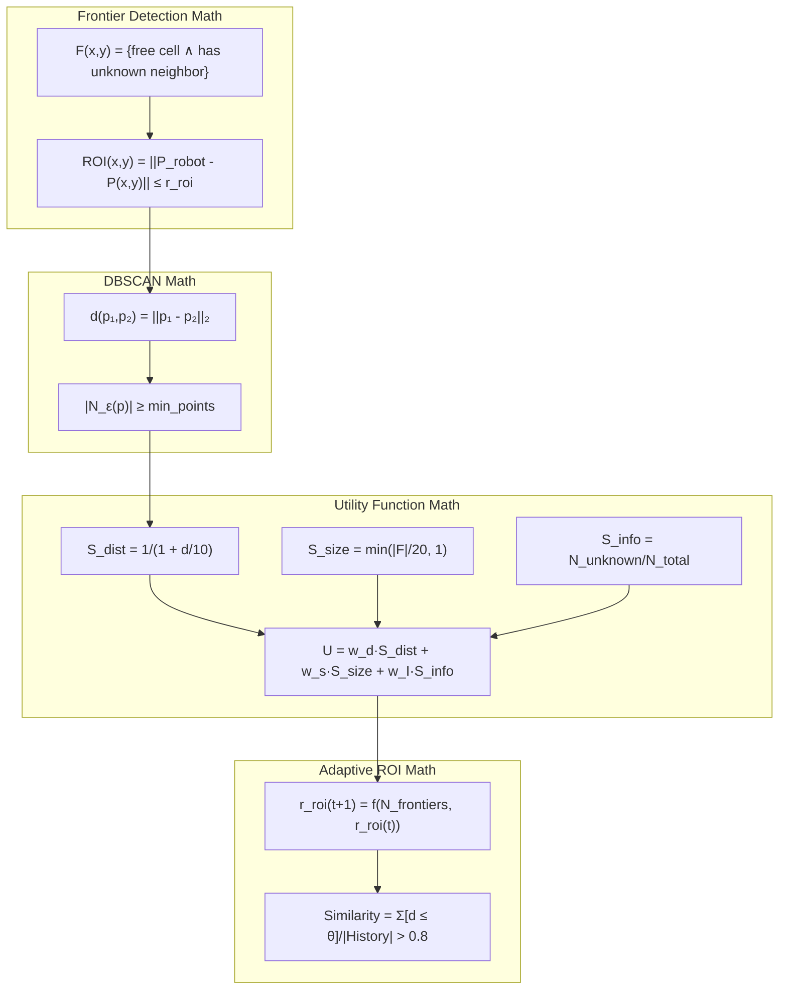
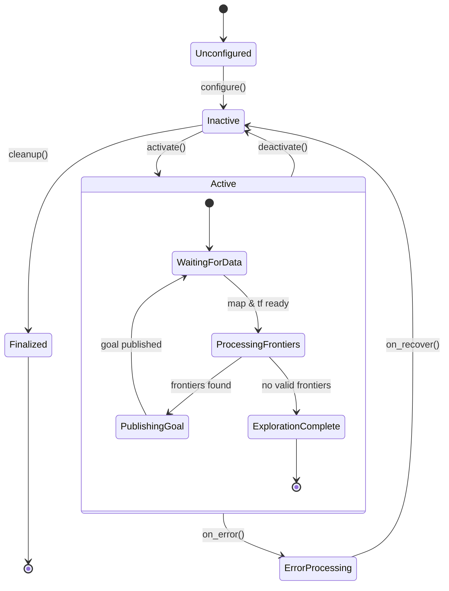
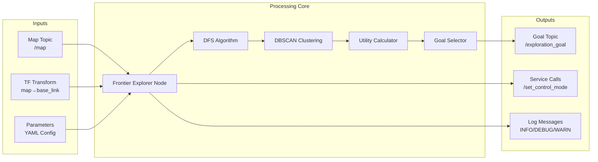

# Frontier Explorer Operational Flow Diagram

## System Overview



## Detailed Algorithm Flow

```mermaid
graph LR
    subgraph "Stage 1: Initialization"
        A1[Node Activation] --> A2[Set Autonomous Mode]
        A2 --> A3[Start Timer]
    end
    
    subgraph "Stage 2: Data Validation"
        B1[Check Map Available] --> B2[Update Robot Pose via TF]
        B2 --> B3{Valid Data?}
        B3 -->|No| B1
    end
    
    subgraph "Stage 3: Frontier Detection"
        C1[Initialize Visited Grid] --> C2[Scan ROI Cells]
        C2 --> C3[DFS Flood Fill]
        C3 --> C4[Collect Frontier Points]
    end
    
    subgraph "Stage 4: DBSCAN Clustering"
        D1[Calculate Distances] --> D2[Find Core Points]
        D2 --> D3[Expand Clusters]
        D3 --> D4[Filter by Min Size]
    end
    
    subgraph "Stage 5: Utility Optimization"
        E1[Distance Score] --> E4[Combined Utility]
        E2[Size Score] --> E4
        E3[Information Gain] --> E4
        E4 --> E5[Sort Frontiers]
    end
    
    subgraph "Stage 6: Goal Selection"
        F1[Check Utility Threshold] --> F2[Similarity Detection]
        F2 --> F3[Select Best Frontier]
        F3 --> F4[Publish Goal]
    end
    
    A3 --> B1
    B3 -->|Yes| C1
    C4 --> D1
    D4 --> E1
    E5 --> F1
    F4 --> B1
```



## Mathematical Operations Flow



## State Machine Transitions



## Data Flow Architecture



## Performance Profiling Flow

```mermaid
graph TB
    subgraph "Timing Analysis"
        T1[Total Cycle Time: 50-200ms] --> T2[Frontier Detection: 10-50ms]
        T1 --> T3[DBSCAN: 5-20ms]
        T1 --> T4[Utility Calc: 1-5ms/frontier]
        T1 --> T5[Overhead: ~20ms]
    end
    
    subgraph "Memory Analysis"
        M1[Grid Processing: O(W×H)] --> M2[Visited Array]
        M1 --> M3[Frontier Storage: O(F×P)]
        M1 --> M4[History Buffer: O(H)]
    end
    
    subgraph "Complexity Analysis"
        C1[DFS: O(n)] --> C2[DBSCAN: O(n log n)]
        C2 --> C3[Utility: O(k×r²)]
        C3 --> C4[Total: O(n log n)]
    end
```
