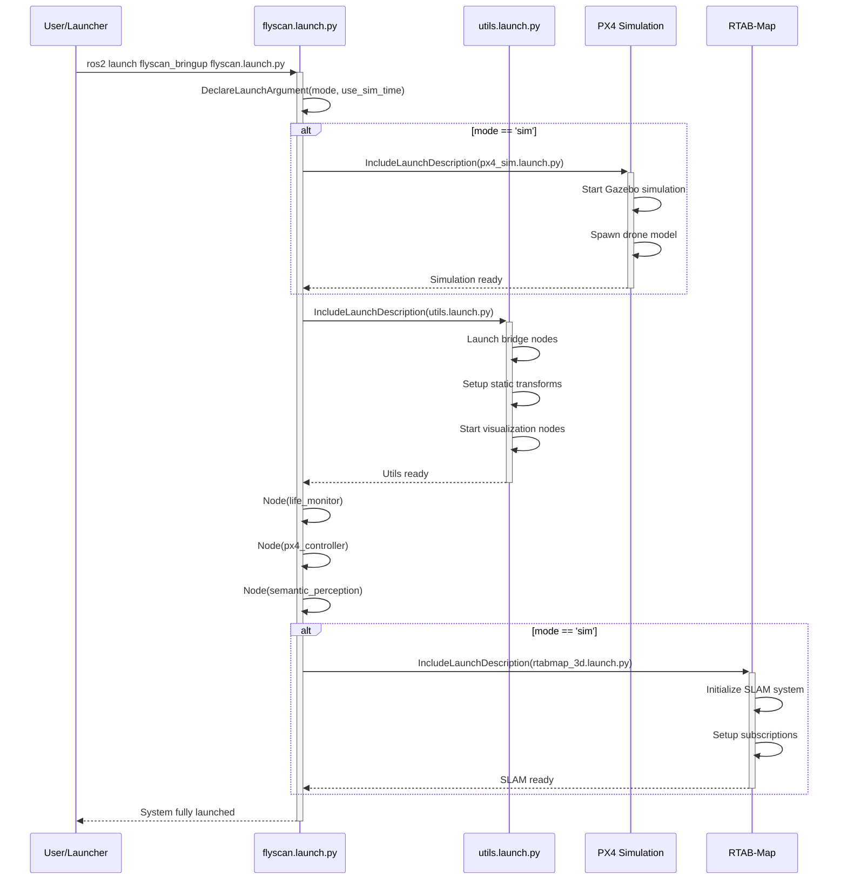
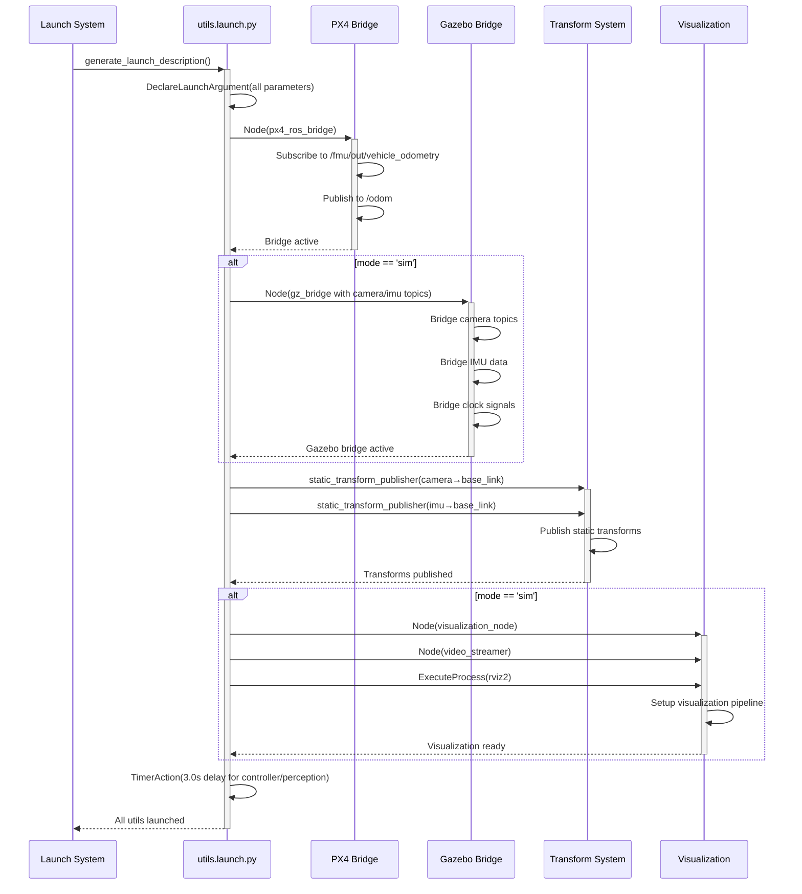
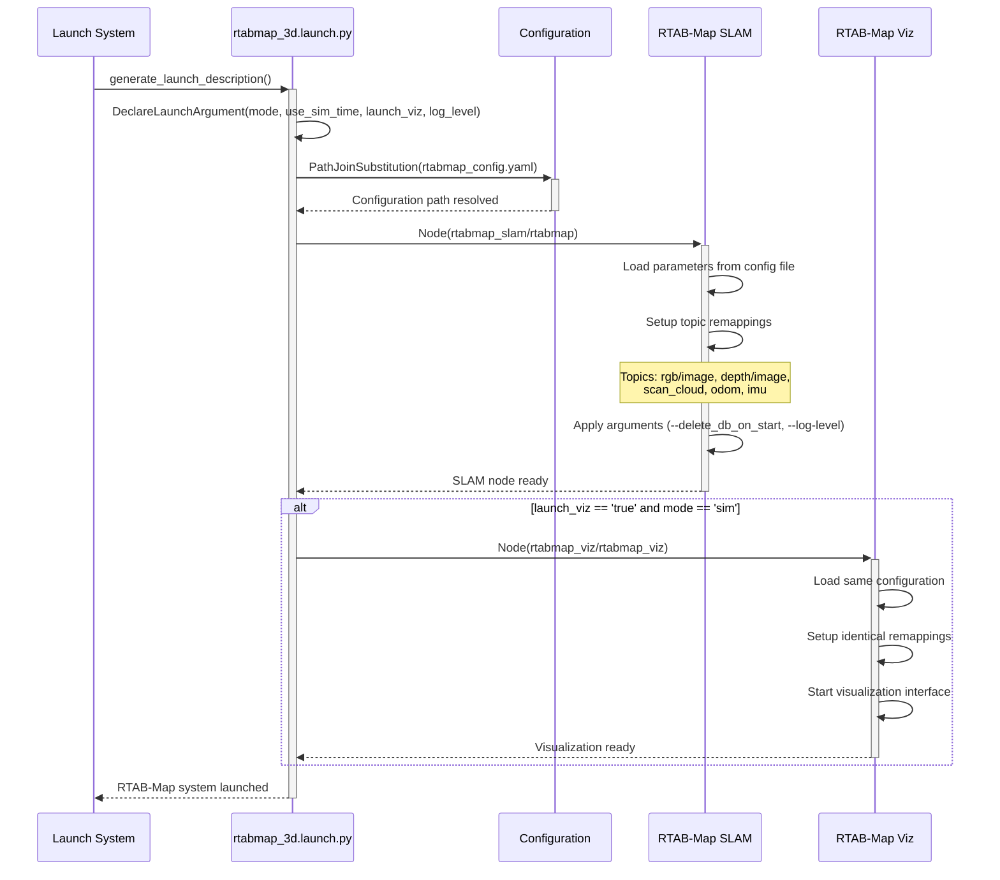
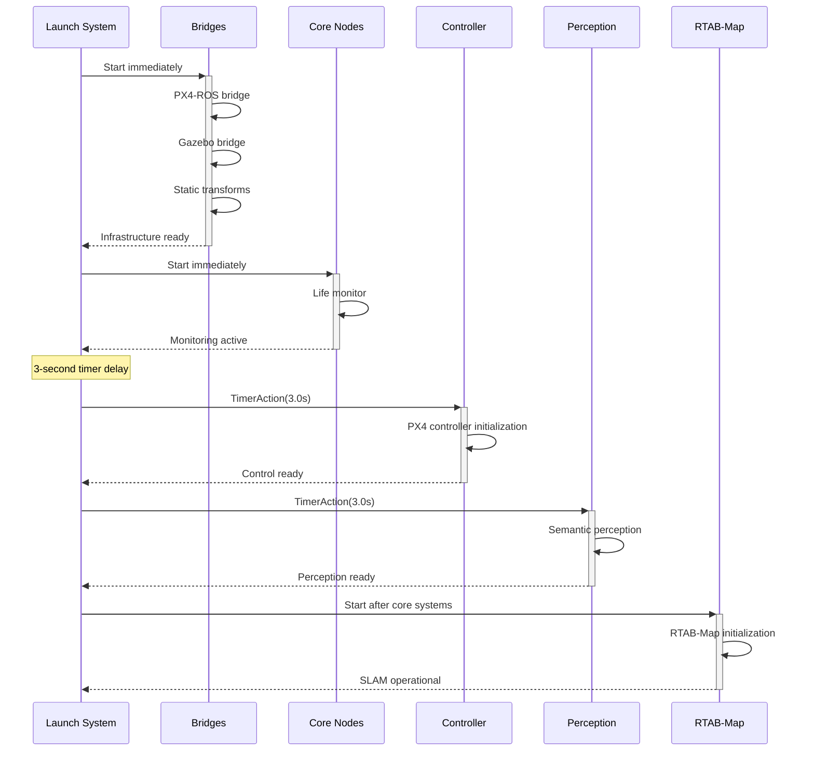

# FlyScan Bringup Package

## Overview

The `flyscan_bringup` package serves as the main orchestration layer for the FlyScan system. It contains launch files that coordinate the startup of all system components, from simulation environment to perception and control nodes.

## Purpose

- Orchestrate system-wide launch sequences
- Manage node dependencies and startup timing
- Configure different operational modes (simulation vs deployment)
- Coordinate inter-node communication and data flow
- Provide centralized configuration management

## Components

### Main Launch Files

#### flyscan.launch.py

Primary system launcher that brings up the complete FlyScan stack.

**Launch Arguments:**

- `mode`: Operation mode ('sim' or 'deploy')
- `use_sim_time`: Use simulation time synchronization

**Launched Components:**

- PX4 simulation environment (sim mode only)
- Core system utilities
- Life monitoring system
- PX4 controller
- Semantic perception pipeline
- RTAB-Map SLAM (sim mode only)

#### utils.launch.py

Utility components launcher providing essential bridge and visualization services.

**Launch Arguments:**

- `use_sim_time`: Simulation time flag
- `mode`: Operation mode
- `rtabmap_launch`: Enable RTAB-Map
- `life_monitor`: Enable life monitoring
- `px4_controller`: Enable PX4 controller
- `semantic_perception`: Enable perception pipeline

**Launched Components:**

- PX4-ROS2 bridge
- Gazebo-ROS2 bridge (sim mode)
- Static transform publishers
- Visualization nodes
- RViz2 interface

#### rtabmap_3d.launch.py

RTAB-Map 3D SLAM launcher for mapping and localization.

**Launch Arguments:**

- `mode`: Operation mode
- `use_sim_time`: Simulation time flag
- `launch_viz`: Enable RTAB-Map visualization
- `log_level`: RTAB-Map logging level

## Sequence Diagrams

### System Startup Sequence



### Utils Launch Sequence



### RTAB-Map Launch Sequence



### Node Startup Timing Sequence



## Key Features

- **Multi-mode Operation**: Supports both simulation and deployment configurations
- **Dependency Management**: Proper sequencing of node startup with timing controls
- **Bridge Integration**: Seamless connection between PX4, Gazebo, and ROS2
- **Transform Management**: Automated static transform setup for sensor frames
- **Modular Architecture**: Conditional launching based on operational requirements
- **Configuration Management**: Centralized parameter and configuration handling

## Configuration Files

- `config/gz_bridge_config.yaml`: Gazebo-ROS2 bridge configuration
- `config/rtabmap_config.yaml`: RTAB-Map SLAM parameters

## Dependencies

- `flyscan_simulation`: PX4 simulation environment
- `flyscan_core`: Core system components
- `flyscan_drone_controller`: Flight control system
- `flyscan_perception`: Perception pipeline
- `flyscan_bridges`: Bridge components
- `rtabmap_slam`: 3D SLAM system
- `ros_gz_bridge`: Gazebo-ROS2 bridge
- `tf2_ros`: Transform system

## Usage Examples

### Basic Simulation Launch

```bash
ros2 launch flyscan_bringup flyscan.launch.py mode:=sim
```

### Deployment Mode

```bash
ros2 launch flyscan_bringup flyscan.launch.py mode:=deploy use_sim_time:=false
```

### Utilities Only

```bash
ros2 launch flyscan_bringup utils.launch.py mode:=sim px4_controller:=true semantic_perception:=true
```

### RTAB-Map with Visualization

```bash
ros2 launch flyscan_bringup rtabmap_3d.launch.py launch_viz:=true log_level:=info
```
