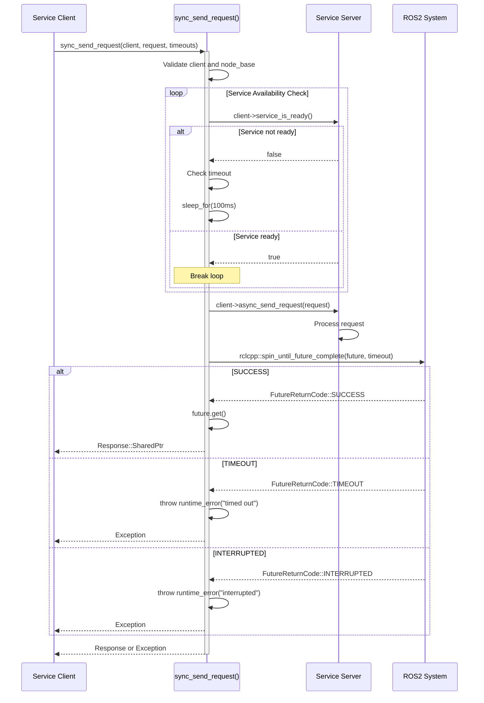
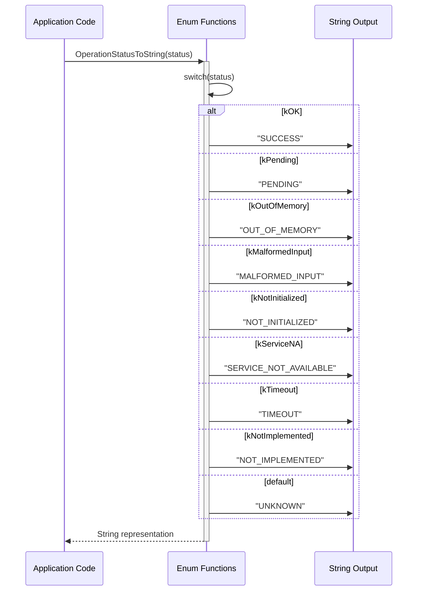
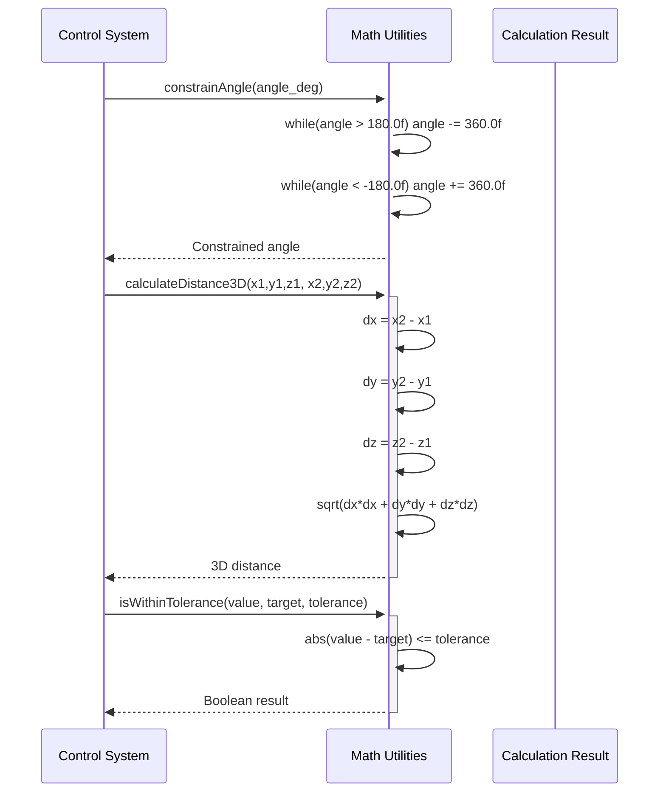
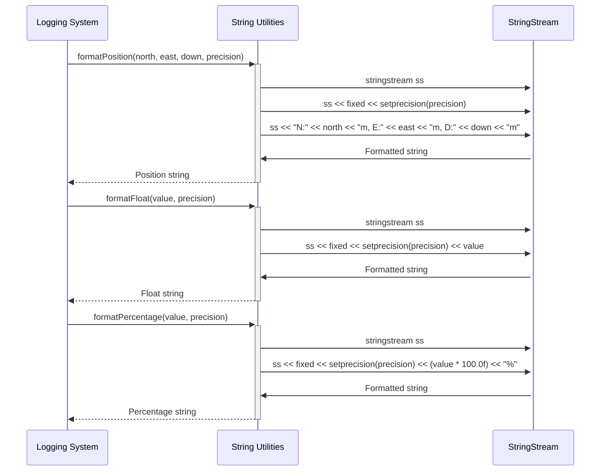
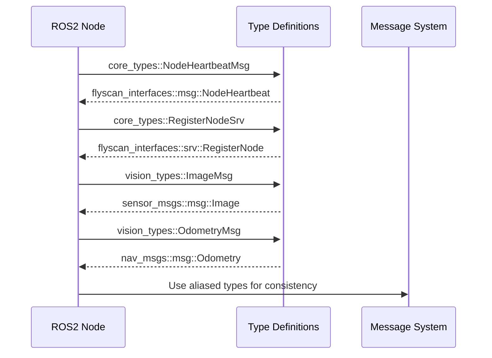

# FlyScan Common Package

## Overview
The `flyscan_common` package provides shared utility functions, type definitions, enums, and common functionality used across all FlyScan system components. It serves as the foundational library ensuring consistency and code reuse throughout the project.

## Purpose
- Define common data types and enumerations
- Provide mathematical utility functions for drone operations
- Offer string formatting utilities for logging and display
- Implement synchronous service request utilities
- Establish standardized return codes and status definitions

## Components

### Header Files

#### enums.hpp
Defines common enumerations used throughout the FlyScan system.

**Enumerations:**
- `OperationStatus`: Function return status codes (OK, Pending, OutOfMemory, etc.)
- `NodeType`: Classification of node types (Navigation, Perception, Controller, etc.)  
- `ControlMode`: Drone control modes (Manual, Teleop, Autonomous, Mission, RTL, Land)

**Utility Functions:**
- `OperationStatusToString()`: Convert status enum to string
- `NodeTypeToString()`: Convert node type enum to string
- `ControlModeToString()`: Convert control mode enum to string

#### math_util.hpp
Mathematical utility functions for drone control calculations.

**Functions:**
- `constrainAngle()`: Constrain angle to [-180, 180] degrees
- `calculateDistance3D()`: 3D Euclidean distance calculation
- `calculateDistance2D()`: 2D Euclidean distance calculation
- `isWithinTolerance()`: Tolerance-based value comparison

**Constants:**
- `DEG_TO_RAD`: Degrees to radians conversion factor
- `RAD_TO_DEG`: Radians to degrees conversion factor

#### string_util.hpp
String formatting utilities for display and logging.

**Functions:**
- `formatPosition()`: Format NED coordinates as readable string
- `formatFloat()`: Format float with specified precision
- `formatPercentage()`: Format value as percentage string

#### types.hpp
Type aliases and definitions for ROS2 message types and service definitions.

**Namespaces:**
- `core_types`: Lifecycle and service type aliases
- `vision_types`: Sensor message type aliases

#### request_util.hpp
Utility functions for synchronous ROS2 service requests.

**Functions:**
- `sync_send_request()`: Synchronous service request with timeout handling

## Sequence Diagrams

### Service Request Utility Flow


### Enum Conversion Sequence


### Mathematical Utility Usage


### String Formatting Flow


### Type Definition Usage


## Key Features
- **Centralized Definitions**: Common enums and types used system-wide
- **Mathematical Utilities**: Optimized inline functions for drone calculations
- **Service Utilities**: Robust synchronous service request handling
- **String Formatting**: Consistent formatting for logging and display
- **Type Safety**: Strong typing through enumerations
- **Header-only Design**: All utilities implemented as inline functions for performance

## Design Patterns
- **Namespace Organization**: Clear separation of functionality domains
- **Template-based Service Utilities**: Generic service request handling
- **Inline Functions**: Zero-overhead utility functions
- **Exception Safety**: Proper error handling in service utilities
- **Const Correctness**: Immutable constants and proper const usage

## Dependencies
- `rclcpp`: ROS2 C++ client library
- `rclcpp_lifecycle`: Lifecycle node support
- `flyscan_interfaces`: Custom message and service definitions
- `sensor_msgs`: Standard sensor message types
- `nav_msgs`: Navigation message types
- Standard C++ libraries: `<cmath>`, `<string>`, `<future>`, `<chrono>`

## Usage Examples

### Using Enumerations
```cpp
#include "flyscan_common/enums.hpp"
using namespace flyscan::common;

OperationStatus status = OperationStatus::kOK;
std::string status_str = OperationStatusToString(status); // "SUCCESS"

ControlMode mode = ControlMode::kAutonomous;
std::string mode_str = ControlModeToString(mode); // "AUTONOMOUS"
```

### Mathematical Calculations
```cpp
#include "flyscan_common/math_util.hpp"
using namespace flyscan::common;

float angle = 190.0f;
float constrained = constrainAngle(angle); // -170.0f

float distance = calculateDistance3D(0,0,0, 3,4,5); // 7.07...
bool within = isWithinTolerance(10.1f, 10.0f, 0.2f); // true
```

### Service Requests
```cpp
#include "flyscan_common/request_util.hpp"
using namespace flyscan::common;

auto response = sync_send_request<MyService>(
    node_base, client, request,
    std::chrono::milliseconds(2000), // service timeout
    std::chrono::milliseconds(5000)  // request timeout
);
```