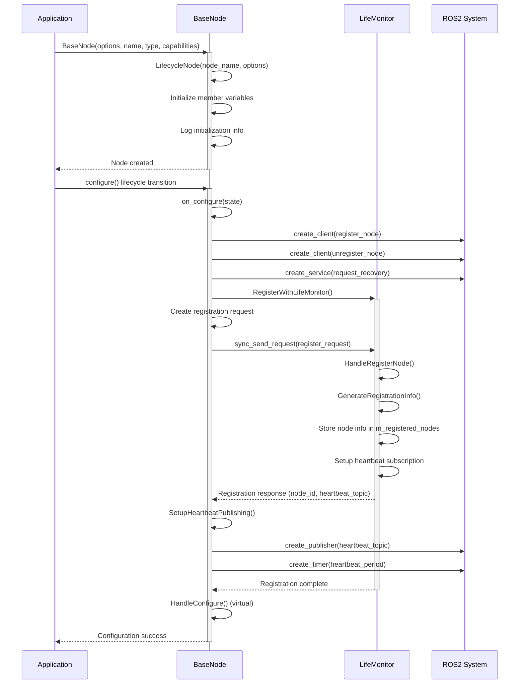
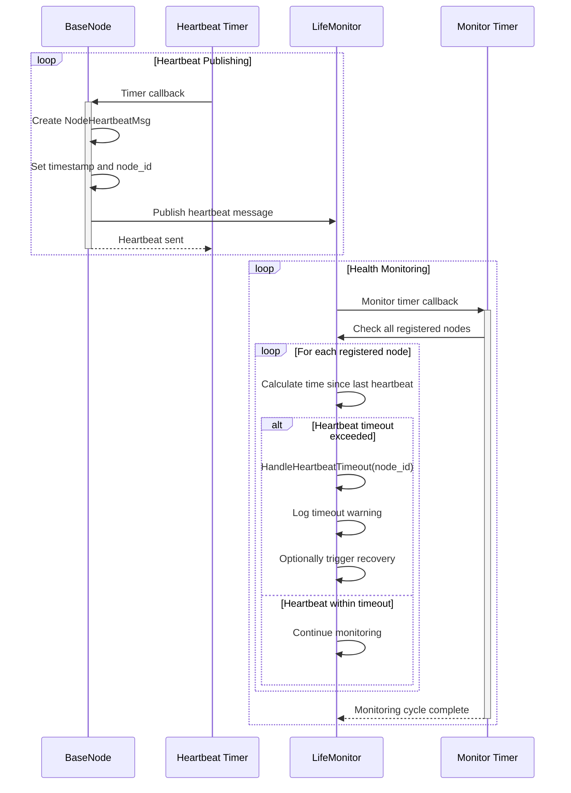
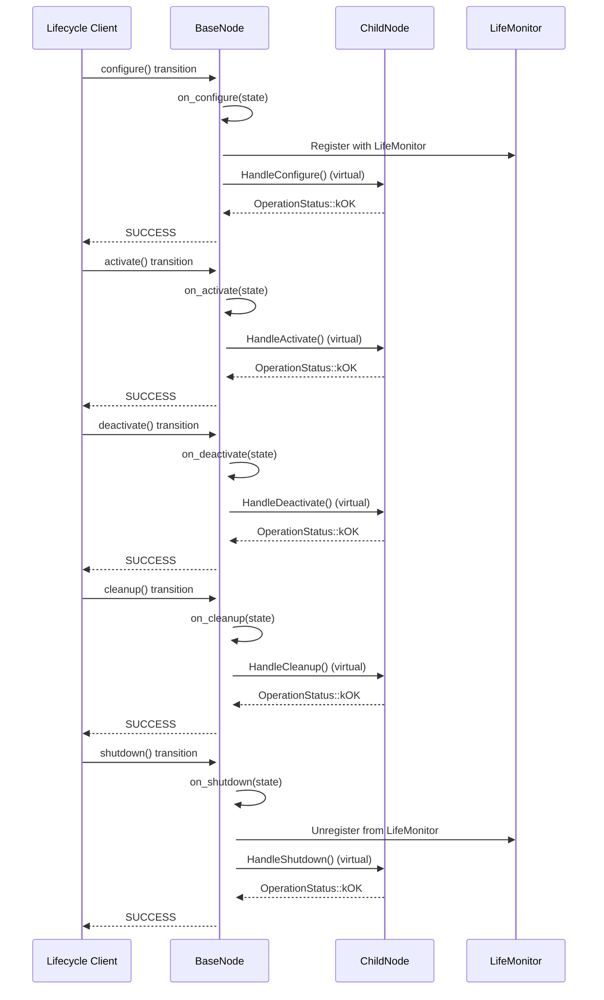
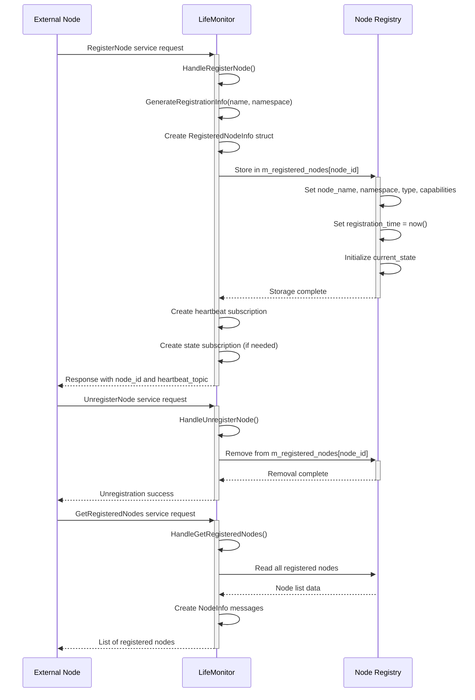
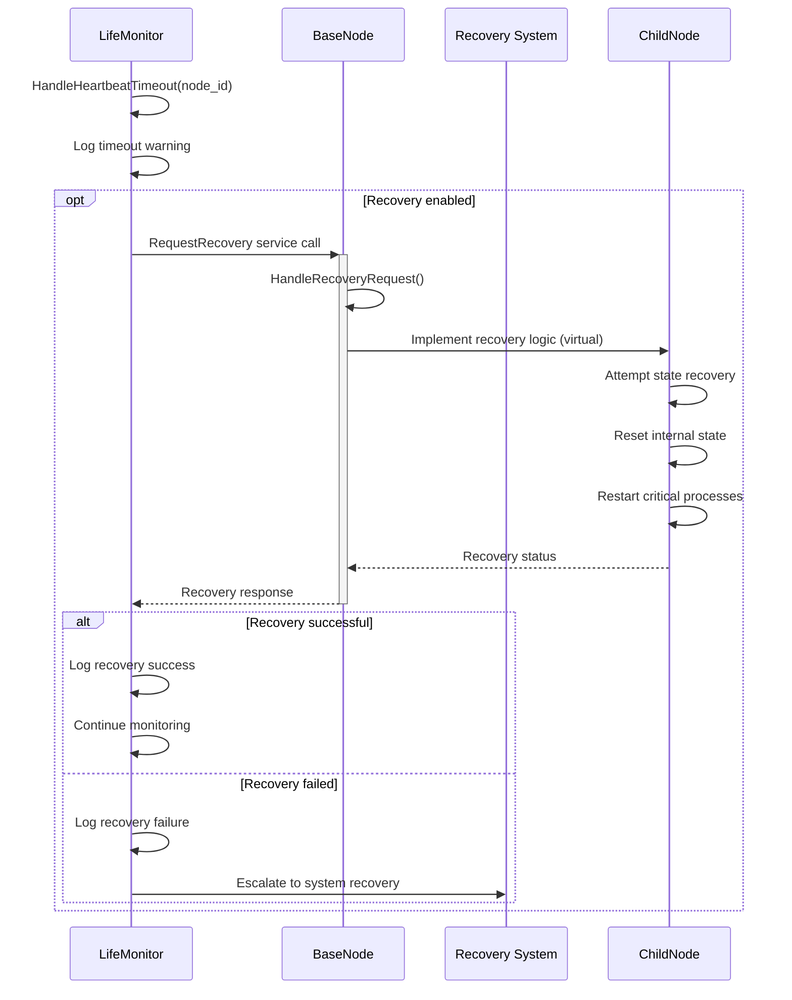

# FlyScan Core Package

## Overview
The `flyscan_core` package provides the foundational infrastructure for the FlyScan system, including lifecycle management, node monitoring, and base class functionality. It implements a robust monitoring system that ensures system health and provides automatic recovery capabilities.

## Purpose
- Provide base class functionality for all FlyScan nodes
- Implement lifecycle management for system components
- Monitor node health and status through heartbeat mechanism
- Manage node registration and recovery processes
- Ensure system reliability and fault tolerance

## Components

### BaseNode Class
Abstract base class that all FlyScan nodes inherit from, providing standardized lifecycle management and monitoring integration.

**Features:**
- Lifecycle state management (Configure, Activate, Deactivate, Cleanup, Shutdown)
- Automatic registration with LifeMonitor
- Heartbeat publishing for health monitoring
- Recovery service handling
- Node type and capability management

**Services:**
- **Provides:** `/life_monitor/request_recovery` (RequestRecovery)
- **Consumes:** `/life_monitor/register_node`, `/life_monitor/unregister_node`

### LifeMonitor Node
Central monitoring node that tracks all registered nodes and manages system health.

**Features:**
- Node registration and unregistration management
- Heartbeat monitoring with timeout detection
- System-wide health status tracking
- Node recovery coordination
- Registration information management

**Services:**
- **Provides:** `/life_monitor/register_node`, `/life_monitor/unregister_node`, `/life_monitor/get_registered`
- **Subscribes to:** Node-specific heartbeat topics

### Constants
Centralized constant definitions for the core system.

**Categories:**
- Service endpoints and topic names
- QoS settings for publishers and subscribers
- Timeout and timing configurations

## Sequence Diagrams

### Node Initialization and Registration


### Heartbeat Monitoring Sequence


### Node Lifecycle State Transitions


### Service Request Handling


### Recovery Process Flow


## Key Features
- **Lifecycle Management**: Standardized state transitions for all system nodes
- **Health Monitoring**: Continuous heartbeat-based health checking
- **Automatic Registration**: Seamless integration with system monitoring
- **Recovery Capabilities**: Built-in recovery mechanisms for failed nodes
- **Thread Safety**: Thread-safe node registry with shared mutex protection
- **Service Integration**: Comprehensive service-based communication
- **Extensible Design**: Virtual methods for custom node behavior

## Design Patterns
- **Template Method Pattern**: BaseNode provides lifecycle framework with virtual hooks
- **Observer Pattern**: LifeMonitor observes node health through heartbeats
- **Registry Pattern**: Centralized node registration and management
- **Command Pattern**: Service-based recovery and management commands
- **RAII**: Automatic resource management through destructors

## Dependencies
- `rclcpp`: ROS2 C++ client library
- `rclcpp_lifecycle`: Lifecycle node support
- `rclcpp_components`: Component registration
- `flyscan_common`: Common types and utilities
- `flyscan_interfaces`: Custom message and service definitions
- `lifecycle_msgs`: Standard lifecycle messages

## Usage Examples

### Creating a Custom Node
```cpp
#include "flyscan_core/base_node.hpp"

class MyCustomNode : public flyscan::core::BaseNode
{
public:
    MyCustomNode(const rclcpp::NodeOptions& options = rclcpp::NodeOptions())
        : BaseNode(options, "my_custom_node", 
                   flyscan::common::NodeType::kPerception,
                   {"sensor_processing", "data_analysis"})
    {
    }

protected:
    OperationStatus HandleConfigure() override {
        // Custom configuration logic
        return OperationStatus::kOK;
    }
    
    OperationStatus HandleActivate() override {
        // Custom activation logic
        return OperationStatus::kOK;
    }
};
```

### Lifecycle Management
```cpp
auto node = std::make_shared<MyCustomNode>();
auto executor = std::make_shared<rclcpp::executors::MultiThreadedExecutor>();
executor->add_node(node->get_node_base_interface());

// Transition through lifecycle states
node->configure();
node->activate();
// Node is now active and monitored
node->deactivate();
node->cleanup();
```

### Monitoring System Status
```cpp
auto monitor = std::make_shared<flyscan::core::LifeMonitor>(rclcpp::NodeOptions());
// LifeMonitor automatically handles registration and monitoring
// Use GetRegisteredNodes service to query system status
```