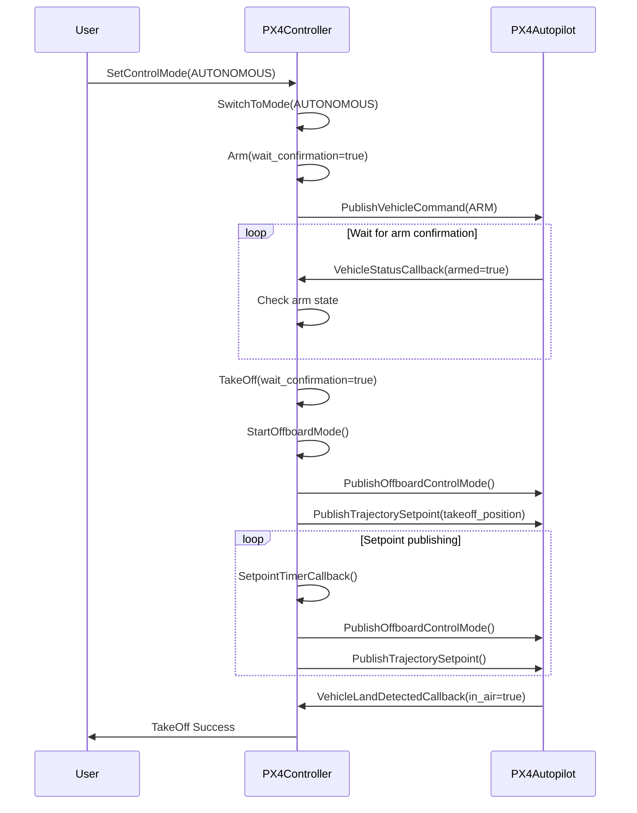
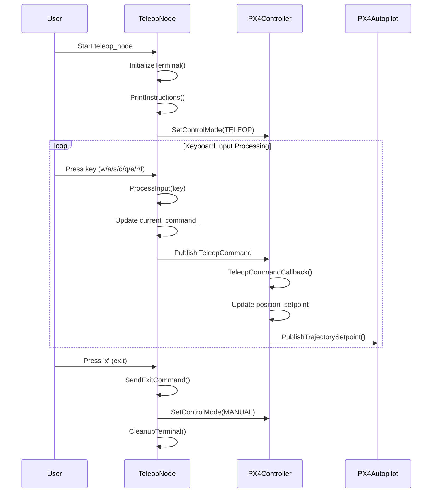

# FlyScan Drone Controller

## Overview

The FlyScan Drone Controller package provides advanced PX4 autopilot control capabilities for autonomous UAVs. It implements a centralized control system with multiple operation modes, lifecycle management, and seamless mode switching between manual, teleoperation, and autonomous flight.

## Components

### 1. PX4Controller Class

**File**: `src/px4_controller.cpp`, `include/flyscan_drone_controller/px4_controller.hpp`

The main controller class that inherits from `BaseNode` and provides:

- **Lifecycle Management**: Configure, activate, deactivate, cleanup, shutdown, and error handling
- **Flight Control**: Arm, takeoff, land, and offboard mode management
- **Mode Switching**: Manual, teleop, autonomous, mission, RTL, and land modes
- **State Monitoring**: Vehicle position, status, and land detection
- **Thread-Safe Operations**: Mutex-protected state management

### 2. TeleopNode Class

**File**: `src/teleop_node.cpp`, `include/flyscan_drone_controller/teleop_node.hpp`

Interactive keyboard teleoperation interface providing:

- **Real-time Control**: WASD movement, QE yaw control, RF altitude control
- **Pattern Execution**: Automated figure-8 flight patterns
- **Terminal Management**: Raw keyboard input handling without requiring Enter
- **Safety Features**: Emergency stop and mode exit capabilities

## Behavioral design

### 1. Flight Initialization and Takeoff Sequence



### 2. Teleoperation Control Flow



## Configuration

### Parameters

- `TAKEOFF_ALTITUDE`: Default takeoff altitude (-1.5m in NED)
- `POSITION_STEP`: Movement step size (0.5m)
- `YAW_STEP`: Yaw rotation step (10.0°)
- `SETPOINT_RATE_MS`: Control loop rate (50ms)

### Topics

- **Publishers**:
  - `/fmu/in/offboard_control_mode`: Offboard control mode
  - `/fmu/in/trajectory_setpoint`: Position/velocity setpoints
  - `/fmu/in/vehicle_command`: Vehicle commands (arm/disarm/mode)

- **Subscribers**:
  - `/fmu/out/vehicle_local_position`: Vehicle position feedback
  - `/fmu/out/vehicle_status`: Vehicle status and mode
  - `/fmu/out/vehicle_land_detected`: Landing detection
  - `/teleop_command`: Teleoperation commands
  - `/exploration_goal`: Autonomous navigation goals

### Services

- `/set_control_mode`: Mode switching service

## Usage Examples

### Starting Teleoperation

```bash
# Terminal 1: Start PX4 controller
ros2 run flyscan_drone_controller px4_controller

# Terminal 2: Start teleoperation
ros2 run flyscan_drone_controller teleop_node
```

### Mode Switching via Service

```bash
# Switch to autonomous mode
ros2 service call /set_control_mode flyscan_interfaces/srv/SetControlMode "{mode: 2}"

# Switch to teleop mode  
ros2 service call /set_control_mode flyscan_interfaces/srv/SetControlMode "{mode: 1}"
```

### Integration with FlyScan System

```bash
# Launch with full FlyScan stack
ros2 launch flyscan_bringup flyscan.launch.py enable_controller:=true
```

This package forms the core flight control interface in the FlyScan system, providing safe and reliable drone control with multiple operation modes and comprehensive monitoring capabilities.
