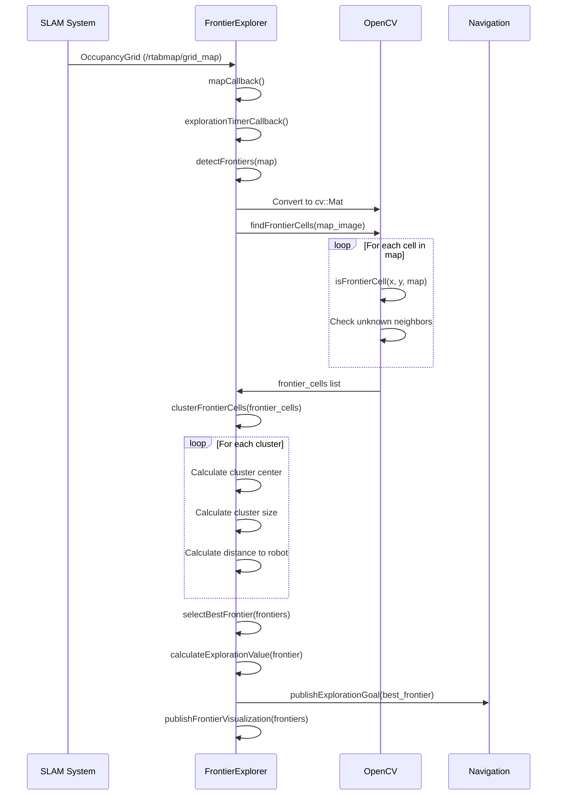
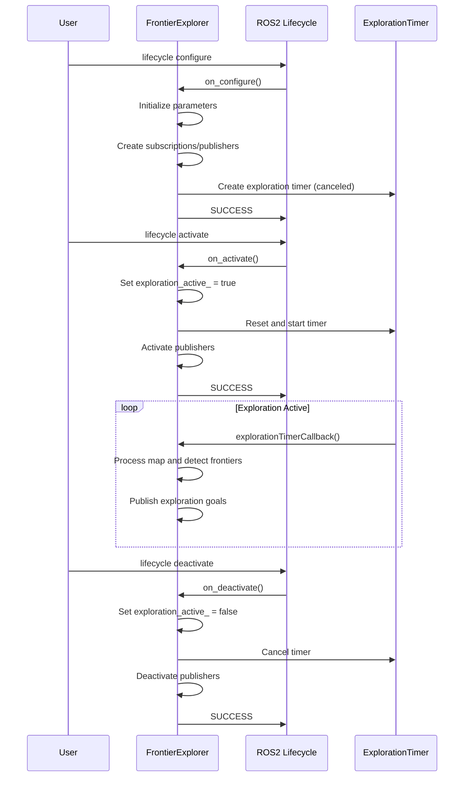
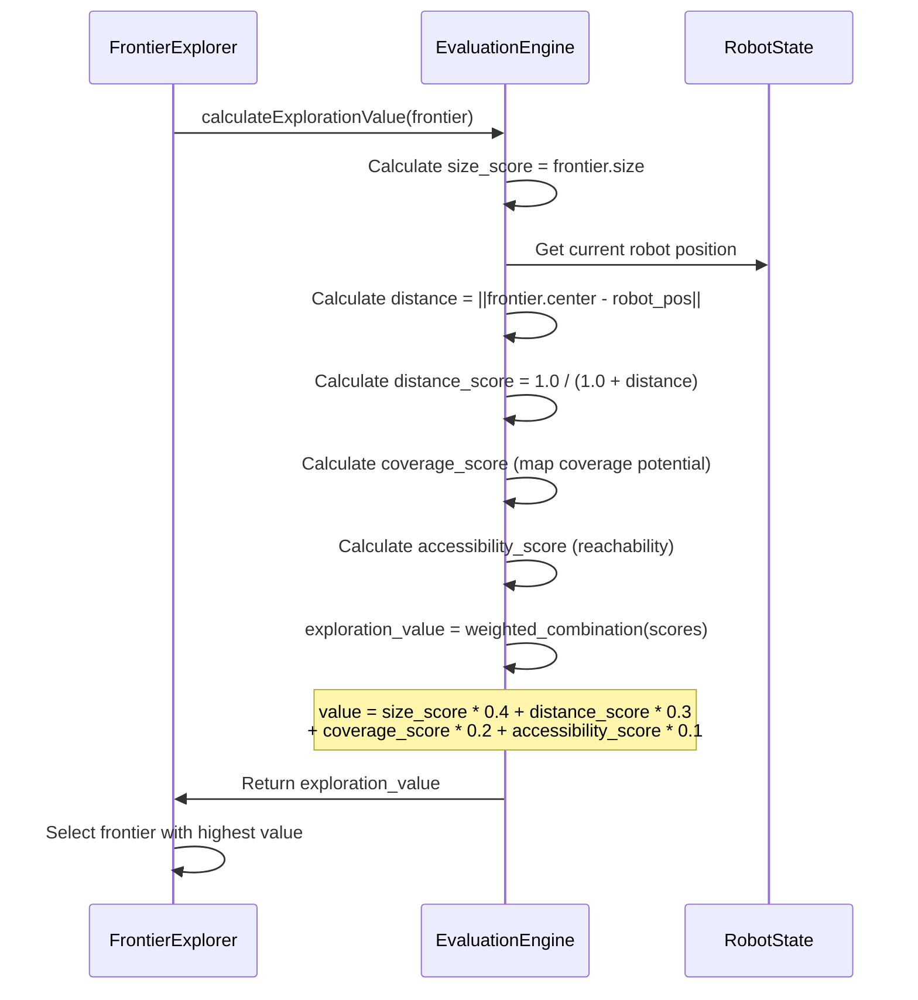

# FlyScan Exploration

## Overview

The FlyScan Exploration package implements frontier-based autonomous exploration for UAVs. It analyzes occupancy grid maps to identify unexplored regions (frontiers) and generates exploration goals to systematically map unknown environments. This package is specifically designed for indoor and outdoor autonomous mapping missions.

## Purpose

This package enables:

- **Autonomous Exploration**: Systematic exploration of unknown environments
- **Frontier Detection**: Identification of boundaries between known and unknown areas
- **Goal Generation**: Smart selection of exploration targets based on multiple criteria
- **Real-time Mapping**: Integration with SLAM systems for continuous map updates
- **Mission Planning**: Strategic exploration to maximize mapping efficiency

## Components

### 1. FrontierExplorer Class

**File**: `src/frontier_explorer.cpp`, `include/flyscan_exploration/frontier_explorer.hpp`

The main exploration controller that implements a lifecycle node for managing autonomous exploration:

- **Lifecycle Management**: Configure, activate, deactivate, and cleanup states
- **Frontier Detection**: Computer vision-based frontier identification
- **Goal Selection**: Multi-criteria frontier evaluation and selection
- **Real-time Processing**: Continuous map analysis and goal generation
- **Visualization**: Real-time frontier and goal visualization

**Key Methods**:

- `detectFrontiers()`: Main frontier detection algorithm
- `selectBestFrontier()`: Intelligent frontier selection based on exploration value
- `publishExplorationGoal()`: Goal publication for navigation systems
- `calculateExplorationValue()`: Multi-factor frontier scoring

### 2. Frontier Structure

**File**: `include/flyscan_exploration/frontier_explorer.hpp` (lines 28-34)

Data structure representing exploration frontiers:

```cpp
struct Frontier {
    geometry_msgs::msg::Point center;        // Frontier centroid
    std::vector<geometry_msgs::msg::Point> points;  // All frontier points
    double size;                            // Number of frontier cells
    double distance_to_robot;               // Distance from current position
    double exploration_value;               // Computed exploration priority
};
```

## Sequence Diagrams

### 1. Frontier Detection and Goal Generation



### 2. Lifecycle State Management



### 3. Multi-Criteria Frontier Evaluation



## Key Features

### Frontier Detection Algorithm

- **Edge Detection**: Identification of boundaries between known free and unknown space
- **Clustering**: Grouping nearby frontier cells into coherent exploration targets
- **Size Filtering**: Removal of small, insignificant frontiers below minimum threshold
- **Real-time Processing**: Efficient algorithm suitable for continuous operation

### Multi-Criteria Goal Selection

- **Size Priority**: Larger frontiers offer more exploration potential
- **Distance Optimization**: Balance between nearby and distant targets
- **Coverage Analysis**: Preference for frontiers that reveal maximum new area
- **Accessibility Assessment**: Consideration of navigation feasibility

### Robust Map Processing

- **Thread-Safe Operations**: Mutex-protected map and odometry access
- **Frame Transformations**: Proper coordinate system handling via TF2
- **Quality Filtering**: Robust handling of noisy or incomplete map data
- **Adaptive Parameters**: Configurable exploration parameters for different environments

### Visualization and Monitoring

- **Real-time Visualization**: Frontier markers in RViz for monitoring
- **Goal Tracking**: Published exploration goals for navigation integration
- **Performance Metrics**: Size, distance, and value information for each frontier

## Dependencies

### Core Dependencies

- `rclcpp` / `rclcpp_lifecycle`: ROS2 lifecycle node functionality
- `nav_msgs`: Occupancy grid and odometry messages
- `geometry_msgs`: Point and pose message types
- `tf2_ros` / `tf2_geometry_msgs`: Coordinate frame transformations
- `visualization_msgs`: Marker arrays for visualization

### Computer Vision Dependencies

- `opencv4`: Image processing and computer vision algorithms
- `cv_bridge`: OpenCV-ROS2 image conversion
- `grid_map_ros` / `grid_map_core` / `grid_map_cv`: Grid map processing

### System Dependencies

- SLAM system (RTABMap, Cartographer, etc.) for map generation
- Navigation stack for goal execution
- TF2 transforms between coordinate frames

## Configuration

### Parameters

- `exploration_radius` (default: 10.0): Maximum exploration range in meters
- `min_frontier_size` (default: 5): Minimum frontier size to consider
- `frontier_cluster_distance` (default: 2.0): Maximum distance for frontier clustering
- `exploration_rate` (default: 1.0): Exploration goal update frequency in Hz

### Topics

#### Subscriptions

- `/rtabmap/grid_map` (nav_msgs/OccupancyGrid): SLAM-generated occupancy grid
- `/odom` (nav_msgs/Odometry): Robot odometry for position tracking

#### Publications

- `/exploration_goal` (geometry_msgs/PoseStamped): Selected exploration target
- `/frontier_markers` (visualization_msgs/MarkerArray): Frontier visualization

### Frame Requirements

- Proper TF2 transforms between map, odom, and base_link frames
- Consistent coordinate system alignment between SLAM and exploration

## Algorithm Details

### 1. Frontier Detection Process (`detectFrontiers` function:208-243)

**Algorithm: Occupancy Grid Frontier Identification**

1. **Map Preprocessing**: Convert OccupancyGrid to OpenCV image format
   - **Mapping**: -1 (unknown) → 127, 0 (free) → 255, >0 (occupied) → 0
   - **Purpose**: Standardize grid values for computer vision processing
2. **Cell Analysis**: Scan each pixel for frontier characteristics  
3. **Frontier Identification**: Apply `isFrontierCell()` algorithm
4. **Clustering**: Group adjacent frontier cells using breadth-first search
5. **Filtering**: Remove clusters smaller than `min_frontier_size_` threshold

### 2. Frontier Cell Identification (`isFrontierCell` function:259-278)

**Algorithm: 8-Connected Neighbor Analysis**

- **Mathematical Condition**: Cell (x,y) is frontier if:
  - `map[y][x] == 127` (unknown cell)
  - ∃ neighbor (x+dx, y+dy) where `map[y+dy][x+dx] == 255` (free cell)
- **Neighbor Check**: Examine all 8-connected neighbors: (dx,dy) ∈ {-1,0,1}²\{(0,0)}
- **Logic**: Frontiers exist at boundaries between known free space and unknown regions

### 3. Frontier Clustering (`clusterFrontierCells` function:284-337)

**Algorithm: Connected Component Analysis with BFS**

- **Distance Metric**: Euclidean distance `d = √((x₁-x₂)² + (y₁-y₂)²)`
- **Clustering Condition**: Cells within `frontier_cluster_distance_/resolution` pixels are connected
- **BFS Implementation**:
  - Initialize queue with unvisited frontier cell
  - For each dequeued cell, find all unvisited neighbors within distance threshold
  - Add neighbors to queue and mark as visited
- **Centroid Calculation**: `center = (Σxᵢ/n, Σyᵢ/n)` for all points in cluster

### 4. Exploration Value Calculation (`calculateExplorationValue` function:352-357)

**Algorithm: Multi-factor Frontier Scoring**

```cpp
// Mathematical formulation:
size_factor = frontier.size / 100.0
distance_factor = max(0.1, 1.0 / (1.0 + distance_to_robot))
exploration_value = size_factor × distance_factor
```

- **Size Component**: Rewards larger frontiers (more exploration potential)
- **Distance Component**: Inverse distance weighting favors closer frontiers
- **Minimum Threshold**: 0.1 prevents division by zero for very distant frontiers

### 5. Coordinate Transformations (`mapToWorld`/`worldToMap` functions:399-413)

**Algorithm: Occupancy Grid Coordinate Conversion**

- **Map → World Transform**:

  ```cpp
  world_x = map.origin.position.x + map_x × resolution
  world_y = map.origin.position.y + map_y × resolution
  ```

- **World → Map Transform**:

  ```cpp
  map_x = (world_x - map.origin.position.x) / resolution
  map_y = (world_y - map.origin.position.y) / resolution
  ```

- **Mathematical Basis**: Affine transformation using grid resolution and origin offset
- **Purpose**: Convert between discrete grid indices and continuous world coordinates

### Goal Selection Strategy

- **Primary Criterion**: Maximize exploration value across all detected frontiers
- **Tie Breaking**: Prefer closer frontiers when values are similar
- **Safety Checks**: Ensure selected goals are reachable and safe
- **Persistence**: Avoid rapid goal switching to maintain exploration efficiency

## Usage Examples

### Basic Exploration Launch

```bash
# Start SLAM system first
ros2 launch flyscan_bringup rtabmap_3d.launch.py

# Launch exploration
ros2 launch flyscan_exploration frontier_exploration.launch.py
```

### Lifecycle Management

```bash
# Configure the explorer
ros2 lifecycle set /frontier_explorer configure

# Activate exploration
ros2 lifecycle set /frontier_explorer activate

# Deactivate when done
ros2 lifecycle set /frontier_explorer deactivate
```

### Parameter Configuration

```bash
# Set exploration parameters
ros2 param set /frontier_explorer exploration_radius 15.0
ros2 param set /frontier_explorer min_frontier_size 8
ros2 param set /frontier_explorer exploration_rate 0.5
```

### Integration with Navigation

```bash
# Launch complete autonomous exploration system
ros2 launch flyscan_bringup flyscan.launch.py enable_exploration:=true
```

## Performance Considerations

### Computational Efficiency

- **Map Resolution**: Higher resolution maps increase processing time exponentially
- **Update Rate**: Balance between responsiveness and computational load
- **Clustering Algorithm**: O(n²) complexity requires optimization for large frontier sets
- **Memory Usage**: Proportional to map size and number of detected frontiers

### Exploration Quality

- **Parameter Tuning**: Adjust parameters based on environment characteristics
- **Goal Persistence**: Avoid oscillatory behavior with stable goal selection
- **Coverage Metrics**: Monitor exploration progress to ensure complete coverage
- **Safety Margins**: Maintain safe distances from obstacles during exploration

## Troubleshooting

### Common Issues

#### No Frontiers Detected

- **Cause**: Map too sparse or exploration already complete
- **Solution**: Verify SLAM is producing quality maps, check exploration radius

#### Rapid Goal Switching

- **Cause**: Similar exploration values causing instability
- **Solution**: Adjust evaluation weights, increase minimum frontier size

#### Poor Goal Selection

- **Cause**: Suboptimal parameter configuration
- **Solution**: Tune weights in exploration value calculation for specific environment

#### Frame Transformation Errors

- **Cause**: Missing or incorrect TF2 transforms
- **Solution**: Verify SLAM system publishes proper transforms, check frame IDs

This package provides intelligent autonomous exploration capabilities, enabling FlyScan drones to systematically map unknown environments with minimal human intervention.
