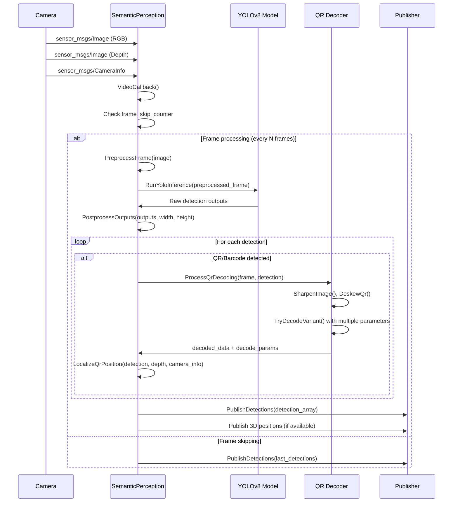
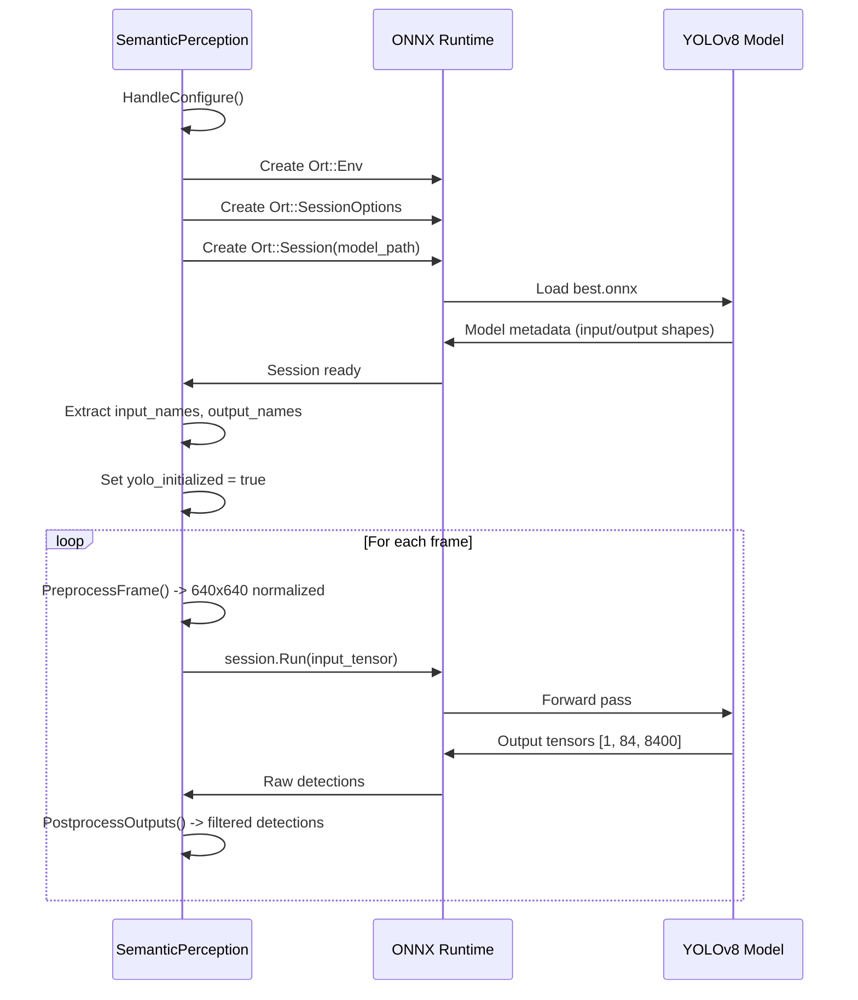

# FlyScan Perception

## Overview

The FlyScan Perception package provides advanced computer vision capabilities for semantic understanding and object detection in autonomous mapping missions. It implements YOLOv8-based object detection with specialized QR code and barcode recognition, enabling semantic mapping and intelligent navigation for UAV systems.

## Purpose

This package enables:

- **Real-time Object Detection**: YOLOv8-powered detection of QR codes and barcodes
- **Semantic Mapping**: Integration of detected objects with spatial information
- **QR/Barcode Decoding**: Advanced preprocessing and decoding of visual markers
- **3D Localization**: Depth-based 3D positioning of detected objects
- **Performance Optimization**: Frame skipping and adaptive processing for real-time operation

## Components

### 1. SemanticPerception Class

**File**: `src/semantic_perception.cpp`, `include/flyscan_perception/semantic_perception.hpp`

The main perception node that inherits from `BaseNode` and provides:

- **YOLOv8 Integration**: ONNX Runtime-based object detection inference
- **Multi-Modal Processing**: RGB and depth image synchronization
- **Real-time Performance**: Optimized processing pipeline with frame skipping
- **3D Localization**: Camera intrinsics-based depth projection
- **Robust Decoding**: Advanced QR/barcode preprocessing and decoding

**Key Methods**:

- `RunYoloInference()`: Main YOLO detection pipeline
- `ProcessQrDecoding()`: Enhanced QR/barcode decoding with preprocessing
- `LocalizeQrPosition()`: 3D position estimation using depth data
- `PublishDetections()`: Detection result publishing

### 2. Detection Structure

**File**: `include/flyscan_perception/semantic_perception.hpp` (lines 40-46)

Internal detection representation:

```cpp
struct Detection {
    cv::Rect bbox;              // Bounding box in image coordinates
    float confidence;           // Detection confidence (0.0-1.0)
    int class_id;              // Object class identifier
    std::string decoded_data;   // QR/barcode decoded content
    std::string decode_params;  // Successful decoding parameters (JSON)
};
```

### 3. Enhanced QR Processing

**Files**: Multiple methods in `semantic_perception.cpp`

Advanced QR/barcode processing pipeline:

- **Preprocessing**: Sharpening, contrast enhancement, perspective correction
- **Deskewing**: Automatic rotation correction for angled QR codes
- **Multi-variant Decoding**: Parameter sweeping for robust decoding
- **Quality Assessment**: Confidence-based result validation

## Sequence Diagrams

### 1. Real-time Object Detection Pipeline



### 2. YOLOv8 Model Initialization and Inference



### 3. Advanced QR/Barcode Decoding Process

```mermaid
sequenceDiagram
    participant SP as SemanticPerception
    participant CV as OpenCV
    participant Decoder as QR Decoder

    SP->>SP: ProcessQrDecoding(frame, detections)
    
    loop For each QR/Barcode detection
        SP->>CV: Extract ROI from bbox
        SP->>CV: SharpenImage(roi) - Unsharp masking
        SP->>CV: DeskewQr(roi) - Perspective correction
        
        SP->>SP: TryDecodeVariant() with parameter sweep
        
        loop Multiple decode attempts
            SP->>CV: Apply brightness/contrast (alpha, beta)
            SP->>CV: Apply CLAHE enhancement
            SP->>CV: Rotate by angle (0°, 90°, 180°, 270°)
            SP->>Decoder: detectAndDecode(processed_image)
            
            alt Decoding successful
                Decoder->>SP: decoded_data
                SP->>SP: Store decode_params (JSON)
                break
            else Continue with next parameters
                SP->>SP: Try next parameter combination
            end
        end
        
        alt 3D localization available
            SP->>SP: LocalizeQrPosition(detection, depth, camera_info)
            SP->>SP: Project to 3D coordinates
        end
    end
```

### Parameters

- `inference_frame_skip` (default: 3): Process every Nth frame for inference
- `confidence_threshold` (default: 0.5): Minimum detection confidence
- `model_path`: Path to YOLOv8 ONNX model file
- `class_names`: Object class labels ["Barcode", "QR"]

### Topics

#### Subscriptions

- `/camera/image_raw` (sensor_msgs/Image): RGB camera feed
- `/camera/depth/image` (sensor_msgs/Image): Depth camera feed  
- `/camera/camera_info` (sensor_msgs/CameraInfo): Camera intrinsic parameters

#### Publications

- `/detections` (flyscan_interfaces/DetectionArray): Object detection results
- `/qr_positions` (geometry_msgs/PointStamped): 3D QR code positions

### Model Requirements

- **Input Format**: RGB images, 640x640 pixels, normalized [0,1]
- **Output Format**: [1, 84, 8400] tensor with detection data
- **Classes**: Trained for QR codes (class 1) and barcodes (class 0)

## Algorithm Details

### YOLOv8 Processing Pipeline

1. **Preprocessing**: Resize to 640x640, normalize pixel values
2. **Inference**: Forward pass through ONNX model
3. **Post-processing**: Extract boxes, scores, apply NMS filtering
4. **Coordinate Scaling**: Scale detections back to original image size

### QR/Barcode Decoding Enhancement

1. **ROI Extraction**: Crop detection bounding box with padding
2. **Image Sharpening**: Unsharp masking for edge enhancement
3. **Perspective Correction**: Automatic deskewing using corner detection
4. **Parameter Sweeping**: Multiple decode attempts with varied parameters:
   - Brightness/contrast adjustment (alpha: 0.8-1.2, beta: -20 to +20)
   - CLAHE enhancement (clip: 1.0-4.0, grid: 4x4 to 16x16)
   - Rotation angles (0°, 90°, 180°, 270°)

### 3D Localization Algorithm

```cpp
// Project pixel to 3D using camera intrinsics and depth
float depth_value = depth_image.at<float>(center_y, center_x);
float x_3d = (center_x - cx) * depth_value / fx;
float y_3d = (center_y - cy) * depth_value / fy;
float z_3d = depth_value;
```

## Usage Examples

### Basic Launch

```bash
# Start camera drivers first
ros2 launch realsense2_camera rs_launch.py

# Launch perception node
ros2 run flyscan_perception semantic_perception
```

### Integration with FlyScan System

```bash
# Launch complete FlyScan stack with perception
ros2 launch flyscan_bringup flyscan.launch.py enable_perception:=true
```

### Model Conversion

```bash
# Convert PyTorch model to ONNX format
python convert_model.py --input best.pt --output best.onnx --size 640
```

### Parameter Tuning

```bash
# Adjust inference rate for performance
ros2 param set /semantic_perception inference_frame_skip 5

# Change confidence threshold
ros2 param set /semantic_perception confidence_threshold 0.7
```

## Performance Considerations

### Computational Requirements

- **CPU**: Minimum quad-core processor for real-time operation
- **Memory**: 4GB RAM minimum, 8GB recommended
- **GPU**: NVIDIA GPU with CUDA support for accelerated inference
- **Storage**: 100MB for model files and dependencies

### Optimization Strategies

- **Frame Rate Control**: Adjust inference_frame_skip based on processing capability
- **Model Selection**: Use yolov8n.onnx for faster inference, best.onnx for accuracy
- **Memory Management**: Monitor tensor allocation and deallocation
- **Threading**: Utilize separate threads for inference and I/O operations

## Troubleshooting

### Common Issues

#### Model Loading Failures

- **Cause**: Missing ONNX model file or incompatible format
- **Solution**: Verify model path, ensure proper ONNX export from PyTorch

#### Poor Detection Performance

- **Cause**: Suboptimal lighting, motion blur, or model mismatch
- **Solution**: Adjust camera settings, retrain model with specific data

#### QR Decoding Failures

- **Cause**: Poor image quality, extreme angles, or damaged codes
- **Solution**: Improve lighting, reduce motion, adjust preprocessing parameters

#### Memory Issues

- **Cause**: Large input images or excessive frame rate
- **Solution**: Reduce input resolution, increase frame skipping

This package provides comprehensive computer vision capabilities for the FlyScan system, enabling intelligent object detection and semantic understanding for autonomous mapping applications.
